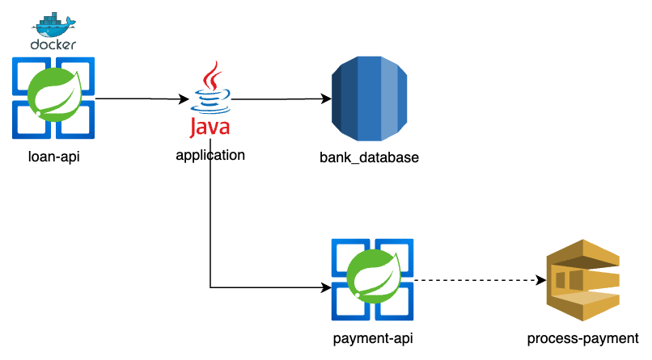

# Projeto de empréstimos

Este projeto configura um sistema de empréstimos, onde é possível fazer o cadastro de uma pessoa e também atribuí-a a um empréstimo.

## Conteúdo

- **Loan API**: Aplicação em Java 21 e SpringBoot.
- [**Arquitetura**](#arquitetura)
- AspectLogger

## Pré-requisitos

- Docker
- Docker Compose
- [IAC](https://github.com/sjsistemasltda/bank_iac)
- [Payment API](https://github.com/sjsistemasltda/payment)
- Maven (Opcional para rodar os testes sem IDE)

## Como usar

1. **Clone o repositório**:
   ```sh
   git clone https://github.com/sjsistemasltda/loan
   cd loan

2. **Faça o build do docker**:
    ```sh
    docker-compose build;

3. **Inicie o container**:
    ```sh
    docker-compose up -d;

4. **Serviços em funcionamento**:
- Loan API: http://localhost:8080
- Actuator: http://localhost:8080/actuator/health

## Execução de testes unitários
   ```sh
   mvn test -Dspring.profiles.active=local
   ```

## cURLs de exemplo

**Criação de pessoa**:
```sh
curl --request POST \
  --url http://localhost:8080/v1/persons \
  --header 'Content-Type: application/json' \
  --data '{
  "name": "Jean Sumara",
  "identifier": "91445956039",
  "identifierType": "PF",
  "birthDate": "24/07/1998"
}'
```

**Atualização de pessoa pelo id**:
```sh
curl --request PUT \
  --url http://localhost:8080/v1/persons/{personId} \
  --header 'Content-Type: application/json' \
  --data '{
  "name": "Jean Sumara +1",
  "birthDate": "24/07/1998"
}'
```

**Buscar pessoa pelo id**:
```sh
curl --request GET \
  --url http://localhost:8080/v1/persons/{personId}
```

**Deletar pessoa pelo id**:
```sh
curl --request DELETE \
  --url http://localhost:8080/v1/persons/{personId}
```

**Criar um empréstimo**:
```sh
curl --request POST \
  --url http://localhost:8080/v1/persons/{personId}/loans \
  --header 'Content-Type: application/json' \
  --data '{
  "amount": 1000,
  "invoiceQuantity": 1
}'
```
## Arquitetura
